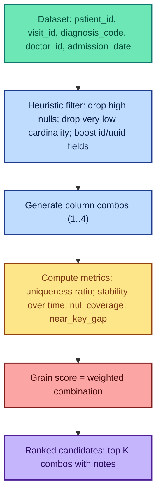
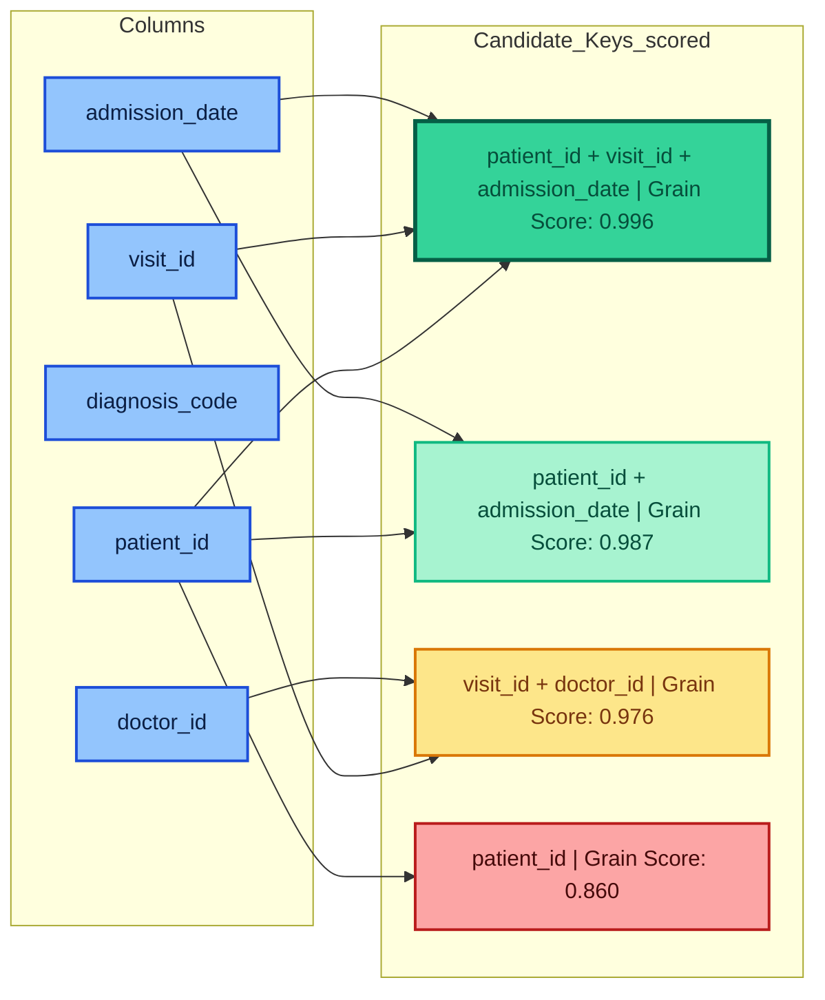

# KeySense (PySpark)

**KeySense** is an open-source PySpark utility for **detecting the record identity** (also known as the *grain*) of a dataset.  
It automatically scans combinations of columns (up to 4) and scores them for:

- **Uniqueness ratio** — How close the combo is to fully unique.
- **Drift stability** — Does it remain unique across partitions (e.g., by day)?
- **Null coverage** — How often any part of the combo is null.
- **Grain score** — Weighted score combining the above metrics.
- **[v0.4.2] near_key_gap** — How far a combo is from being a true key (0.0 = perfect key).

---

## Why?

Most data quality frameworks check nulls, freshness, and schema — but they assume you already know your dataset’s grain.  
Grain detection is the *first step* in trusting your data.

**Without a declared grain, duplicates and "grain drift" can silently break KPIs, joins, and models.**

---

## Installation

Install directly from GitHub (PyPI coming soon):

```bash
pip install "git+https://github.com/yogiadi/keysense-pyspark.git"
```

Or clone from source:

```bash
git clone https://github.com/yogiadi/keysense-pyspark.git
cd keysense-pyspark
```

_try instantly in Colab:_  
[](https://colab.research.google.com/github/yogiadi/keysense-pyspark/blob/main/examples/KeySense_Colab_SmokeTest.ipynb)

---

## Quick Start

### 🟢 PySpark API (toy example)

```python
from pyspark.sql import SparkSession
from keysense import KeySense

spark = SparkSession.builder.appName("KeySenseDemo").getOrCreate()

# Example DataFrame
data = [
    ("u1", "s1", "2025-08-01", "mobile"),
    ("u2", "s2", "2025-08-01", "desktop"),
    ("u1", "s1", "2025-08-02", "mobile"),
    ("u3", "s3", "2025-08-01", "mobile")
]
cols = ["user_id", "session_id", "event_date", "device_id"]
df = spark.createDataFrame(data, cols)

# Run KeySense
ks = KeySense(df, time_col="event_date", max_combo_len=3)
results = ks.evaluate()

# View top results
for r in results.collect():
    print(r)
```

**Sample output:**
```text
{'combo': ('user_id', 'session_id', 'event_date'), 'uniqueness_ratio': 1.0, 'stability_score': 0.98, 'null_coverage': 1.0, 'grain_score': 0.994, 'near_key_gap': 0.0, ...}
{'combo': ('user_id', 'event_date'), 'uniqueness_ratio': 1.0, 'stability_score': 0.95, 'null_coverage': 1.0, 'grain_score': 0.985, 'near_key_gap': 0.01, ...}
```

---

### 🟢 CLI Example (NYC Taxi dataset)

```bash
python -m keysense.profiler   --input yellow_tripdata_2019-01.parquet --format parquet   --time-col tpep_pickup_datetime --time-grain day   --max-combo-len 3 --sample 0.05 --approx-rsd 0.05   --min-col-card 50 --max-null-frac 0.6   --weights 0.6,0.25,0.15 --topk 10   --output out/nyc   --emit-json out/nyc.json   --emit-ge out/nyc_ge
```

This produces:
- `out/nyc/` — Parquet with metrics (`grain_score`, `near_key_gap`, etc.).
- `out/nyc.json` — JSON export of ranked combos.
- `out/nyc_ge/expectations.json` — Great Expectations suite with uniqueness + not-null checks.

---

## Roadmap
- [ ] Sampling for very large datasets ✅ (added v0.4.2)
- [ ] Heuristics to prioritize likely ID columns ✅ (basic version added v0.4.2)
- [ ] CLI support ✅ (v0.4.2)
- [ ] Integration with Great Expectations / Soda ✅ (basic GE export in v0.4.2)

---

## Visual Overview (Healthcare Example)

### Flowchart – How KeySense Works


### Candidate Keys – Example Scoring


---

## Future Plan

KeySense is in its early stages. Planned features:

### 1. Core Enhancements
- **Configurable Scoring Weights** — Adjust weight of uniqueness, stability, null coverage.
- **Improved Heuristic Column Selection** — Stronger ID detection patterns.
- **Grain Drift Detection** — Monitor when keys lose uniqueness over time.

### 2. Performance & Scalability
- **Approximate Distinct Counts** — Already supported (`approx_count_distinct`).
- **Parallel Combo Evaluation**
- **Adaptive Combo Pruning**

### 3. Usability Improvements
- **Extended Result Export** — CSV, Parquet, metadata tables.
- **Deeper Great Expectations & Soda Integration**

### 4. Extended Compatibility
- **Redshift & Snowflake Pushdown**
- **Delta Lake / Iceberg Support**

### 5. Community & Collaboration
- **Benchmarks**
- **Example Notebooks**
- **Contributor Guide**

---

## Project Strategy & Full Roadmap

**KeySense** is an open-source PySpark utility for detecting the record identity (grain) of a dataset by scanning up to 4-column combinations and scoring them based on uniqueness ratio, drift stability, and null coverage.

### Phase 1: Foundations
- ✅ Combo scanning up to 4 columns
- ✅ Stability checks across a time column
- ✅ Grain Score & diagnostics

### Phase 2: Performance & Ergonomics
- ✅ Sampling for large datasets
- ✅ Heuristics for column pruning
- ✅ approx distinct for scalability

### Phase 3: Integrations & Developer Experience
- ✅ CLI
- ✅ JSON + Great Expectations export
- [ ] Metadata table export
- [ ] More example notebooks

### Future Plans
- Configurable scoring weights
- Parallelization & pruning
- Extended integrations

---

## Contributing
Issues and pull requests are welcome!  
Open an issue with ideas, bugs, or feature requests.

---

**Author:** Aditya Yogi  
**License:** MIT
