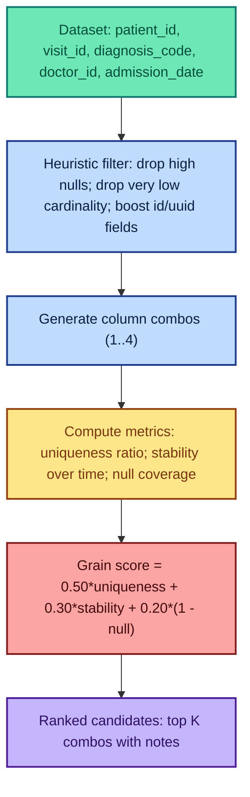
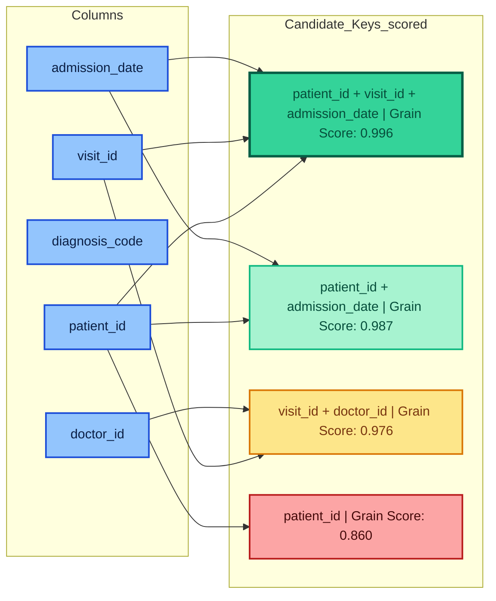

# KeySense (PySpark)

**KeySense** is an open-source PySpark utility for **detecting the record identity** (also known as the *grain*) of a dataset.  
It automatically scans combinations of columns (up to 4) and scores them for:

- **Uniqueness ratio** — How close the combo is to fully unique.
- **Drift stability** — Does it remain unique across partitions (e.g., by day)?
- **Null coverage** — How often any part of the combo is null.
- **Grain score** — Weighted score combining the above metrics.

## Why?

Most data quality frameworks check nulls, freshness, and schema — but they assume you already know your dataset’s grain.  
Grain detection is the *first step* in trusting your data.

**Without a declared grain, duplicates and "grain drift" can silently break KPIs, joins, and models.**

## Installation

Currently, install directly from source:

```bash
git clone https://github.com/yogiadi/keysense-pyspark.git
cd keysense-pyspark
```

## Quick Start

```python
from pyspark.sql import SparkSession
from keysense.profiler import KeySense

spark = SparkSession.builder.appName("KeySenseDemo").getOrCreate()

# Example DataFrame
data = [
    ("u1", "s1", "2025-08-01", "mobile"),
    ("u2", "s2", "2025-08-01", "desktop"),
    ("u1", "s1", "2025-08-02", "mobile"),
    ("u3", "s3", "2025-08-01", "mobile")
]
cols = ["user_id", "session_id", "event_date", "device_id"]
df = spark.createDataFrame(data, cols)

# Run KeySense
ks = KeySense(df, time_col="event_date", max_combo_len=3)
results = ks.evaluate()

# View top results
for r in results[:5]:
    print(r)
```

**Sample output:**
```text
{'combo': ('user_id', 'session_id', 'event_date'), 'uniqueness_ratio': 1.0, 'drift_stability': 0.98, 'null_ratio': 0.0, 'grain_score': 0.994, 'rows_scanned': 4, 'sample_fraction': 0.0}
{'combo': ('user_id', 'event_date'), 'uniqueness_ratio': 1.0, 'drift_stability': 0.95, 'null_ratio': 0.0, 'grain_score': 0.985, 'rows_scanned': 4, 'sample_fraction': 0.0}
...
```

## Roadmap
- [ ] Sampling for very large datasets
- [ ] Heuristics to prioritize likely ID columns
- [ ] CLI support
- [ ] Integration with Great Expectations / Soda

## Visual Overview (Healthcare Example)

### Flowchart – How KeySense Works


### Candidate Keys – Example Scoring


## Future Plan

KeySense is in its early stages. The following features and improvements are planned:

### 1. Core Enhancements
- **Sampling Support** — Enable fast uniqueness scans on very large datasets by sampling rows while maintaining statistical accuracy.
- **Heuristic-Driven Column Selection** — Automatically prioritize likely ID columns based on name patterns and data distribution.
- **Configurable Scoring Weights** — Allow users to adjust the weight of uniqueness, stability, and null coverage in the Grain Score calculation.

### 2. Performance & Scalability
- **Approximate Distinct Counts** — Use `approx_count_distinct` for large datasets to speed up evaluations.
- **Parallel Combo Evaluation** — Leverage Spark's parallelism for faster multi-column scans.
- **Adaptive Combo Pruning** — Stop scanning combos that already fail uniqueness thresholds.

### 3. Usability Improvements
- **Command-Line Interface (CLI)** — Run grain detection directly from the terminal:  
  ```bash
  keysense scan --table events --time-col event_date
  ```
- **Result Export** — Output ranked keys to CSV, Parquet, or a metadata table.
- **Integration Hooks** — Easily connect with data quality tools like Great Expectations or Soda.

### 4. Extended Compatibility
- **Redshift & SQL Integration** — Push down grain detection logic into Redshift/Snowflake for smaller datasets.
- **Delta Lake / Iceberg Support** — Work seamlessly with modern data lake formats.

### 5. Community & Collaboration
- **Public Benchmarks** — Compare performance and accuracy on open datasets like NYC Taxi Trips.
- **Example Notebooks** — Demonstrations with synthetic and real datasets.
- **Contributor Guide** — Clear documentation for adding new features or optimizations.

## Project Strategy & Full Roadmap

**KeySense** is an open-source PySpark utility for detecting the record identity (grain) of a dataset by scanning up to 4-column combinations and scoring them based on uniqueness ratio, drift stability, and null coverage.

### Phase 1: Foundations
- Package minimal PySpark module.
- Implement combination scanning up to 4 columns.
- Add stability checks across a time column (default `event_date`).
- Return ranked results with Grain Score and diagnostics.

### Phase 2: Performance & Ergonomics
- Add sampling for large datasets.
- Heuristics to prioritize likely key columns.
- Filter out high-null or low-cardinality columns.
- Fingerprinting for duplicate detection.

### Phase 3: Integrations & Developer Experience
- Implement CLI.
- Export results to metadata tables.
- Create example notebooks using open datasets like NYC Taxi.
- Provide integration recipes with data quality tools like Great Expectations or Soda.

### Future Plans
- Configurable scoring weights for uniqueness, stability, and null coverage.
- Approximate distinct counts for scalability.
- Parallelized combo evaluation.
- Adaptive combo pruning for efficiency.
- Integration with Redshift/Snowflake for smaller datasets.
- Support for Delta Lake and Apache Iceberg.
- Public performance benchmarks.
- Contributor guide and community engagement via GitHub issues/PRs.

### Publishing Roadmap
1. Launch article introducing KeySense, the problem of grain detection, and why it's needed.
2. Technical deep dive article on the algorithm and design choices.
3. Case study showing grain drift detection.
4. Opinion piece critiquing existing data quality frameworks and how KeySense fills the gap.
5. Integration-focused article showing how to use KeySense with existing DQ frameworks.
6. Community call-to-action for contributors.
7. Benchmark results at scale.
8. Concept-defining piece on "grain drift."

This roadmap is designed for iterative development, public feedback, and long-term adoption in the data engineering community.


## Contributing
Issues and pull requests are welcome!  
Open an issue with ideas, bugs, or feature requests.

---

**Author:** Aditya Yogi  
**License:** MIT
